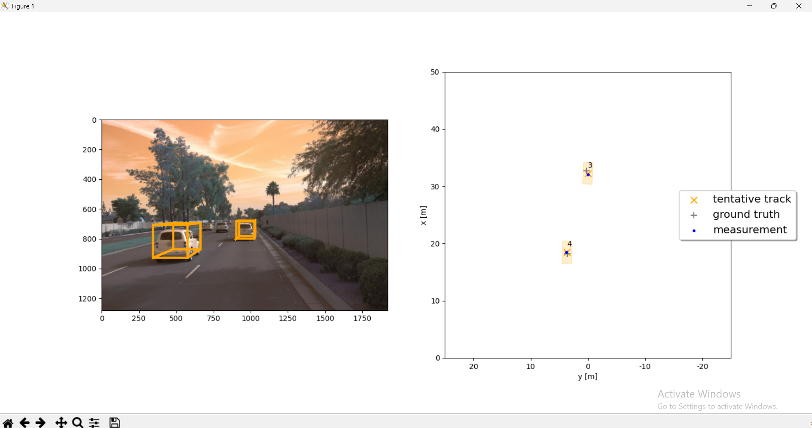

# 3D Sensor Fusion and Multi-Object Tracking — Waymo Open Dataset

A complete LiDAR-camera sensor fusion and vehicle tracking pipeline built on
real-world autonomous driving data from the Waymo Open Dataset.

The project has two main parts: detecting vehicles in 3D LiDAR point clouds,
then tracking them across frames using an Extended Kalman Filter that fuses
both LiDAR and camera measurements.

---

## What I Actually Built

This started from a Udacity course project with empty function stubs.
The parts I implemented myself:

**Sensor Fusion & Tracking (the harder half)**

- Extended Kalman Filter from scratch — 6D state vector (x, y, z, vx, vy, vz),
  system matrix F, process noise Q, full predict/update cycle
- Camera measurement model — non-linear perspective projection from 3D vehicle
  coordinates to 2D image space, including the analytical Jacobian H
- Data association — full Mahalanobis distance matrix between all tracks and
  measurements, with Chi-squared gating to reject outliers
- Track management — initialized/tentative/confirmed state machine,
  FOV-based pruning, covariance-based track deletion

**Point Cloud Processing & Detection**

- LiDAR range image parsing and percentile-based normalization
- Bird's-Eye View generation — 3-channel tensor (intensity, height, density maps)
- Detection evaluation — IoU computation using polygon intersection,
  precision/recall across frames

**Provided by the course (not my work)**

- FPN-ResNet model architecture and pretrained weights
- Camera measurement class structure
- Dataset loading utilities

---

## The Interesting Parts

The trickiest part was getting the camera-LiDAR fusion right. Camera measurements
are non-linear (perspective projection), so the standard Kalman update doesn't
apply directly — you need to linearize around the current state estimate using
the Jacobian. Getting the coordinate transformations right between vehicle space,
camera space, and image space took the most debugging.

Data association was also non-trivial — naive nearest-neighbor matching breaks
down when multiple vehicles are close together. The Mahalanobis distance accounts
for the tracker's uncertainty, so a measurement that's geometrically close but
statistically unlikely gets correctly rejected.

---

## Stack

Python 3.7 · NumPy · OpenCV · PyTorch · Waymo Open Dataset

---

## Results

The pipeline runs end-to-end on real Waymo sequences. Below is a sample output
showing 3D bounding boxes projected onto the front camera view (left) alongside
the Bird's-Eye View tracking space with tentative tracks, ground truth positions,
and LiDAR measurements (right).



Formal RMSE evaluation in progress — quantitative results will be added once
the evaluation pipeline is complete.

---

## Run It

```bash
pip3 install -r requirements.txt
python3 loop_over_dataset.py
```

Configure which pipeline steps run by editing the exec lists in
`loop_over_dataset.py`.
